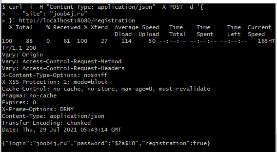
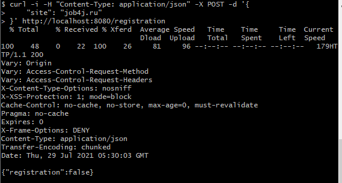
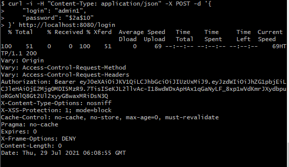
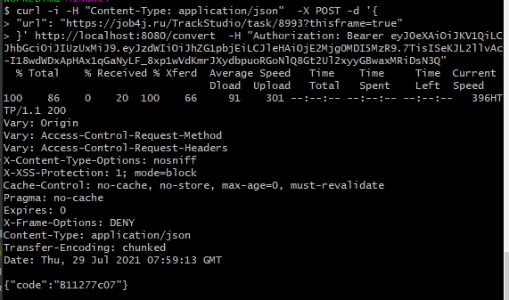
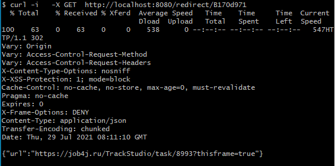
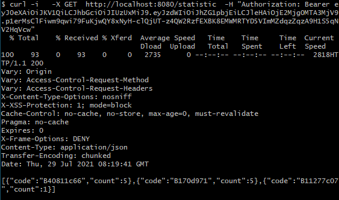

# job4j_url_shortcut
[](https://travis-ci.com/dmitriyermoshin19/job4j_url_shortcut)
[](https://codecov.io/gh/dmitriyermoshin19/job4j_url_shortcut)

### Описание проекта
Сервис позволяет обеспечить безопасность пользователей на сайте заменяя обычные ссылки на преобразованные.  Проект представляет собой так же сервис для сбора статистики посещений страниц для различных сайтов, зарегистрированных в системе. Это веб-приложение реализует принцип архитектуры RESTful.

### Использованные технологии
* Java 14
* Spring Boot 2
* Spring Security & JWT authorization
* Spring Data JPA
* PostgreSQL
* Liquibase
* Maven
* Travis C.I.
* Checkstyle
* Jacoco

### Сценарии использования
Это приложение можно использовать с любой средой разработки, поддерживающей Java (IntellijIDEA, Eclipse, другие).

### HTTP запросы к серверу

#### Регистрация сайта
````
curl --location --request POST 'http://localhost:8080/register' \
--header 'Content-Type: application/json' \
--data-raw '{
    "site": "joob4j.ru"
}'
````



#### Повторная регистрация сайта



#### Получение токена
````
curl --location --request POST 'http://localhost:8080/login' \
--header 'Accept: application/json' \
--header 'Content-Type: application/json' \
--data-raw '{
    "login": "your_login",
    "password": "your_password"
}'
````




#### Конвертация ссылки
````
curl --location --request POST 'http://localhost:8080/convert' \
--header 'Authorization: Bearer your_token\
--header 'Content-Type: application/json' \
--data-raw '{
    "url": "http://job4j.ru:8888/TrackStudio/staticframeset.html#253134"
}'
````




#### Переадресация. Выполняется без авторизации.
````
curl --location --request GET 'http://localhost:8080/redirect/B170d971' \
````




#### Получение статистики
````
curl --location --request GET 'http://localhost:8080/statistic' \
--header 'Authorization: Bearer your_token\
````



#### Контакты
dmstrannnik@bk.ru
